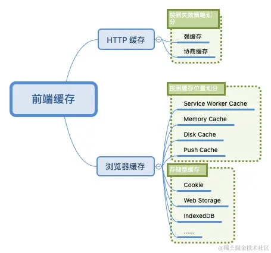
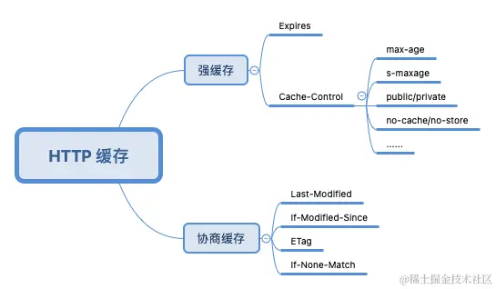

# 前端缓存技术与方案解析

前端开发脱离不了网络和浏览器，前端缓存也可以直接看作是 **HTTP 缓存**和**浏览器缓存**的结合，两者是相辅相成的关系

## 一、缓存分类

## 二、HTTP 缓存

### 2.1、注意点：

1. 当使用 `s-maxage` 指令后，公共缓存服务器将直接忽略 `Expires` 和 `max-age` 指令的值

2. 当设置了 `private` 指令后 `s-maxage` 指令将被忽略。代理服务器也不会进行缓存

3. `no-cache`、`no-store` 这两个指令在请求和响应中都可以使用
   - 当 `no-cache` 在 **请求首部** 中被使用时，表示告知（代理）服务器不直接使用缓存，要求向源服务器发起请求

### 2.2、HTTP 缓存方案

- 频繁变动的资源，比如 HTML， 采用协商缓存
- CSS、JS、图片资源等采用强缓存，使用 hash 命名

Webpack 中 hash 可以分为三种类型：`hash`、`chunkhash`、`contenthash`，区分如下

| 类型        | 介绍                                                       | 优缺点                 |
| ----------- | ---------------------------------------------------------- | ---------------------- |
| hash        | 项目级别的 hash，所有文件也都共用该 hash 值                | 改一处动全身，浪费资源 |
| chunkhash   | 入口文件级别的 hash，会根据入口文件（entry）的依赖进行打包 | 推荐打包公共模块       |
| contenthash | 文件内容级别的 hash，根据文件内容的变化而变化              |                        |

注意项

- 当在 `module` 中使用 `loader` 设置图片或者字体的文件名时，如包含 `hash` 或 `chunkhash` 都是不生效的，默认会使用 `contenthash`
- 将 `chunkhash` 和 `contenthash` 组合使用才能最大化的利用 `HTTP` 缓存中强缓存的优势，减少不必要的资源重复请求，提升网页的整体打开速度

## 三、用户操作与 HTTP 缓存

Chrome 的三种加载模式

- 正常重新加载
- 硬性重新加载
- 清空缓存并硬性重新加载

的区别

| 加载模式               | 快捷键                                         | 特点                                                                                                                                                                                                                                                      |
| ---------------------- | ---------------------------------------------- | --------------------------------------------------------------------------------------------------------------------------------------------------------------------------------------------------------------------------------------------------------- |
| 正常重新加载           | `Ctrl + R`（等同于直接按 F5）                  | 会优先读取缓存                                                                                                                                                                                                                                            |
| 硬性重新加载           | `Ctrl + Shift + R`（等同于直接按 `Ctrl + F5`） | 使用硬性重新加载后所有资源的请求首部都被加上了 `cache-control: no-cache` 和 `pragma: no-cache`，两者的作用都表示告知（代理）服务器不直接使用缓存，要求向源服务器发起请求，而 `pragma` 则是为了兼容 HTTP/1.0。**硬性重新加载并没有清空缓存，而是禁用缓存** |
| 清空缓存并硬性重新加载 | /                                              | **会将浏览器存储的本地缓存都清空掉后再重新向服务器发送请求**，同时其影响的并不是当前网站，所有访问过的网站缓存都将被清除                                                                                                                                  |

注意项

- 三种模式只有在打开控制台后，浏览器左上角才会出现
- 资源异步加载命中缓存不受硬性重新加载控制
  - 在 DOM 渲染好后，异步插入的资源在 硬性重新加载 后，还是会命中缓存
- 针对 `base64` 图片，不管是首次加载还是清空缓存，始终会命中缓存（`from memory cache`）

## 四、浏览器缓存

| 类别         | 优点                                 | 缺点                                           |
| ------------ | ------------------------------------ | ---------------------------------------------- |
| Memory Cache | 获取速度快、优先级高                 | 生命周期短，当网页关闭后内存就会释放；大小受限 |
| Disk Cache   | 生命周期长，不触发删除操作则一直存在 | 获取资源的速度相对较慢                         |

- 缓存读取优先级：内存 > 磁盘 > 网络请求

### 4.1 Preload 与 Prefetch 对缓存的影响

- `preload` 也被称为预加载，其用于 `link` 标签中，可以指明哪些资源是在页面加载完成后即刻需要的，浏览器会在**主渲染机制介入前**预先加载这些资源，并不阻塞页面的初步渲染。

- 当使用 `preload` 预加载资源会保持在**磁盘缓存**中，因为在渲染机制还没有介入前的资源加载不会被内存缓存

- `prefetch` 则表示预提取，告诉浏览器加载下一页面可能会用到的资源，浏览器会利用空闲状态进行下载并将资源存储到缓存中
- 使用 `prefetch` 加载的资源，刷新页面时大概率会从磁盘缓存中读取，如果跳转到使用它的页面，则直接会从磁盘中加载该资源

## 五、相关信息

- [前端缓存技术与方案解析-劳卜](https://juejin.cn/book/6994678547826606095?enter_from=course_center)
